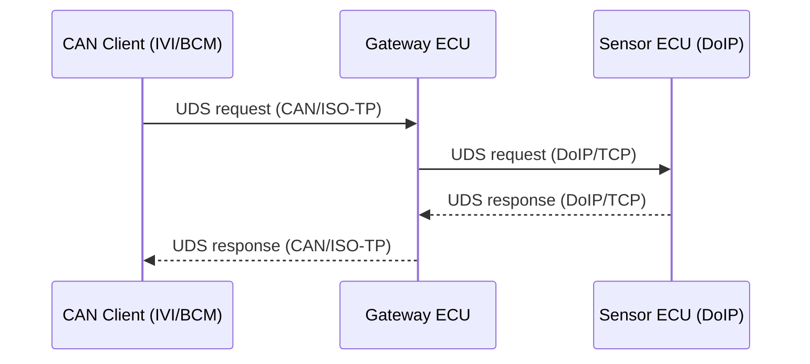

# Virtual Car UDS-over-CAN and UDS-over-DoIP Simulation

This project simulates a multi-network vehicle architecture with a gateway ECU that bridges UDS requests between CAN (using ISO-TP) and Ethernet (using DoIP), plus simulated sensor and client ECUs. It is designed for learning, prototyping, and validating UDS-over-CAN and UDS-over-DoIP communication in a way that closely mirrors real automotive hardware and software.

## Project Structure

- **sensor-ecu/**: Contains `sensor.py`, which acts as a sensor ECU providing vehicle speed and cabin temperature data as a UDS server over DoIP (Ethernet).
- **gateway/**: Contains `gateway.py`, which acts as a simulated vehicle gateway ECU. It receives UDS requests over CAN and forwards them to the sensor ECU over Ethernet (DoIP), then relays the response back over CAN.
- **ivi/**: Contains `ivi.py`, which acts as a UDS client (e.g., an IVI or diagnostic tool) requesting and displaying the cabin temperature over CAN.
- **bcm/**: (Optional) Can be used for a second client, e.g., to request vehicle speed over CAN.
- **SETUP.md**: Step-by-step setup and run instructions.

## Features

- **Realistic UDS-over-CAN and UDS-over-DoIP stack:** Uses `python-can`, `python-can-isotp`, and `udsoncan` for CAN, and native Python sockets for DoIP (Ethernet), matching real vehicle protocol layers.
- **Virtual CAN bus:** Uses Linux’s `vcan0` interface, which emulates a real CAN bus in software—no hardware required.
- **DoIP simulation:** Sensor ECU provides UDS data over a TCP socket using DoIP-style framing, easily portable to real Ethernet hardware.
- **Gateway forwarding:** The gateway receives UDS requests over CAN, forwards them to the sensor ECU over DoIP, and relays the response back to the CAN client.
- **Threaded servers:** Both gateway and sensor ECUs use real Python threads for concurrency, similar to embedded systems.
- **Standard UDS services:** Implements UDS service 0x22 (ReadDataByIdentifier) with correct positive and negative response formats.

## How Close Is This to Real Hardware?

- **Protocol stack:** The code uses the same CAN, ISOTP, DoIP, and UDS protocol layers as real automotive ECUs and diagnostic tools.
- **Message format:** UDS messages, DIDs, and responses are byte-for-byte identical to what you’d see on a real CAN or Ethernet bus.
- **Bus interface:** The only difference is the use of `vcan0` (virtual) instead of a physical CAN interface (e.g., `can0` with a USB-CAN adapter), and `127.0.0.1` for Ethernet. Switching to real hardware is as simple as changing the interface name or IP address.
- **Timing and concurrency:** Signal updates and request/response cycles are managed with real Python threads and timers, similar to embedded systems.
- **Gateway logic:** The gateway does not generate data, but routes UDS requests between CAN and Ethernet, just like a real vehicle gateway.
- **Scalability:** You can add more ECUs or clients, or connect to real hardware, with minimal code changes.

**Limitations compared to real hardware:**

- No electrical noise, bus errors, or arbitration.
- No security access, session control, or advanced diagnostics (but these can be added).
- No interaction with actual vehicle sensors or actuators.

## Architecture Overview



- CAN clients send UDS requests to the gateway over CAN.
- The gateway forwards UDS requests to the sensor ECU over DoIP (Ethernet TCP).
- The sensor ECU responds with simulated data (vehicle speed, cabin temp) over DoIP.
- The gateway relays the response back to the CAN client.

## Run Sequence

1. **Start the Sensor ECU (DoIP server):**

   ```sh
   cd sensor-ecu
   python3 sensor.py
   ```

2. **Start the Gateway (CAN-to-DoIP bridge):**
   Open a new terminal, activate your virtual environment if needed:

   ```sh
   cd gateway
   python3 gateway.py
   ```

3. **Start the CAN clients (e.g., IVI or BCM):**
   Open a new terminal for each client, activate your virtual environment if needed:
   - For IVI (cabin temperature):
     ```sh
     cd ivi
     python3 ivi.py
     ```
   - For BCM (vehicle speed):
     ```sh
     cd bcm
     python3 bcm.py
     ```

**Note:**

- Always start the sensor ECU first, then the gateway, then the clients.
- All components must use the same Python environment and required packages.

## Getting Started

See [SETUP.md](SETUP.md) for full setup and run instructions, including environment setup and dependencies.

## Extending the Project

- Add more DIDs and UDS services to the sensor ECU.
- Implement additional clients (e.g., for vehicle speed or other diagnostics).
- Connect to real Ethernet hardware by changing the IP address in the gateway and sensor ECU.
- Connect to real CAN hardware by changing `vcan0` to your hardware interface (e.g., `can0`).
