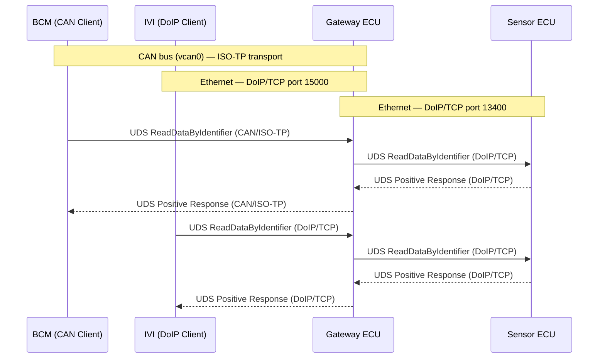
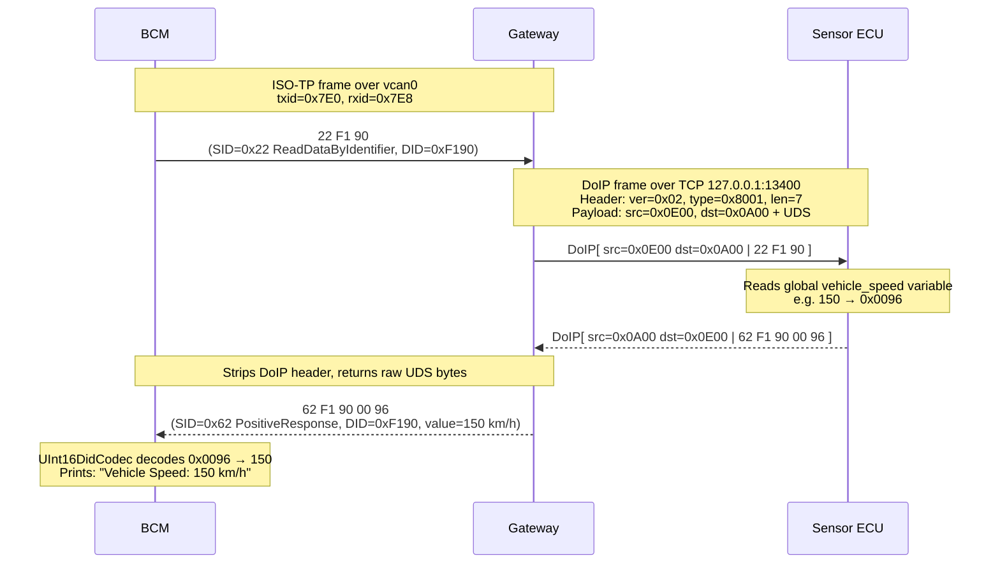
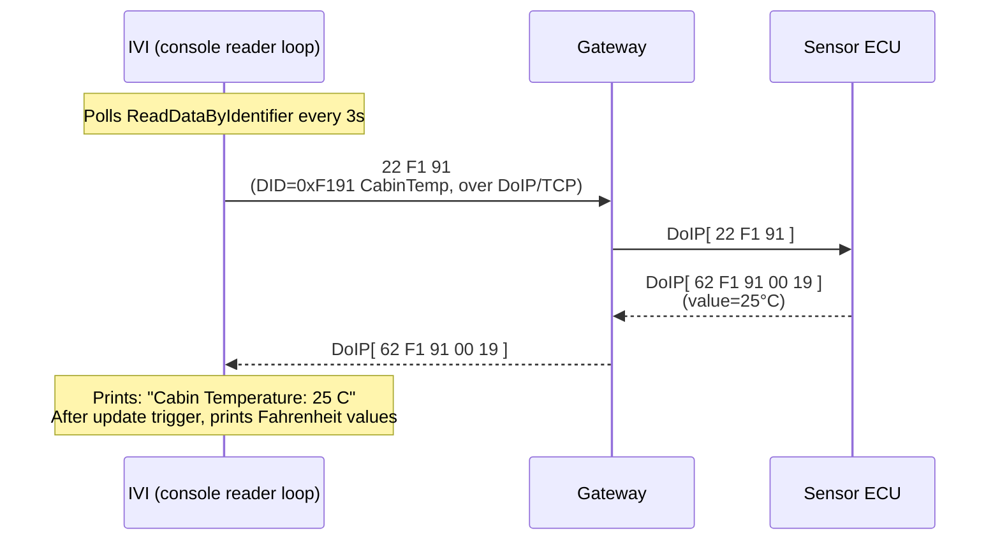
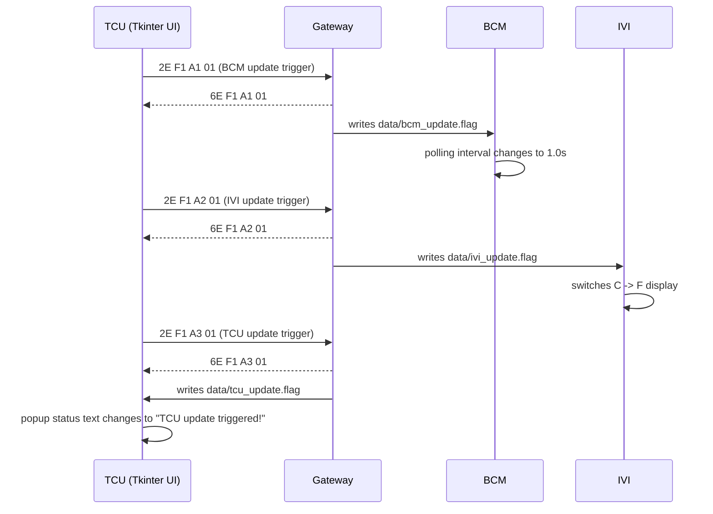

# Virtual Car UDS-over-CAN and UDS-over-DoIP Simulation

This project simulates a multi-network vehicle architecture with a gateway ECU that bridges UDS requests between CAN (using ISO-TP) and Ethernet (using DoIP), plus simulated sensor and client ECUs. It is designed for learning, prototyping, and validating UDS-over-CAN and UDS-over-DoIP communication in a way that closely mirrors real automotive hardware and software.

## Project Structure

- **sensor-ecu/**: Contains `sensor.py`, which acts as a sensor ECU providing vehicle speed and cabin temperature data as a UDS server over DoIP (Ethernet).
- **gateway/**: Contains `gateway.py`, which acts as a simulated vehicle gateway ECU. It receives UDS requests over CAN and forwards them to the sensor ECU over Ethernet (DoIP), then relays the response back over CAN.
- **ivi/**: Contains `ivi.py`, which acts as a UDS client requesting cabin temperature over DoIP (Ethernet) to the Gateway and printing values to the console.
- **bcm/**: Contains `bcm.py`, which reads vehicle speed over CAN and supports runtime update behavior via a trigger file.
- **tcu/**: Contains `tcu.py`, a Tkinter-based update trigger panel that sends DoIP update requests to the Gateway for BCM, IVI, and TCU.
- **data/**: Runtime trigger flag files written by the Gateway and consumed by ECUs (`bcm_update.flag`, `ivi_update.flag`, `tcu_update.flag`).
- **SETUP.md**: Step-by-step setup and run instructions.

## Features

- **Realistic UDS-over-CAN and UDS-over-DoIP stack:** Uses `python-can`, `python-can-isotp`, and `udsoncan` for CAN, and native Python sockets for DoIP (Ethernet), matching real vehicle protocol layers.
- **Virtual CAN bus:** Uses Linux’s `vcan0` interface, which emulates a real CAN bus in software—no hardware required.
- **DoIP simulation:** Sensor ECU provides UDS data over a TCP socket using DoIP-style framing, easily portable to real Ethernet hardware.
- **Gateway forwarding:** The gateway receives UDS requests over CAN/DoIP, forwards read requests to the sensor ECU over DoIP, and relays responses to requesters.
- **Runtime update triggers from TCU:** The TCU sends UDS WriteDataByIdentifier triggers over DoIP to the Gateway:
  - DID `0xF1A1` sets BCM polling interval to 1 second via `data/bcm_update.flag`
  - DID `0xF1A2` switches IVI temperature display from Celsius to Fahrenheit via `data/ivi_update.flag`
  - DID `0xF1A3` creates `data/tcu_update.flag` for TCU-side update signaling
- **Threaded servers:** Both gateway and sensor ECUs use Python threads for concurrency.
- **UDS services:** Service `0x22` (ReadDataByIdentifier) for sensor data and service `0x2E` (WriteDataByIdentifier) for TCU update triggers.

## How Close Is This to Real Hardware?

- **Protocol stack:** The code uses the same CAN, ISOTP, DoIP, and UDS protocol layers as real automotive ECUs and diagnostic tools.
- **Message format:** UDS messages, DIDs, and responses are byte-for-byte identical to what you’d see on a real CAN or Ethernet bus.
- **Bus interface:** The only difference is the use of `vcan0` (virtual) instead of a physical CAN interface (e.g., `can0` with a USB-CAN adapter), and `127.0.0.1` for Ethernet. Switching to real hardware is as simple as changing the interface name or IP address.
- **Timing and concurrency:** Signal updates and request/response cycles are managed with real Python threads and timers, similar to embedded systems.
- **Gateway logic:** The gateway does not generate data, but routes UDS requests between CAN and Ethernet, just like a real vehicle gateway.
- **Scalability:** You can add more ECUs or clients, or connect to real hardware, with minimal code changes.

**Limitations compared to real hardware:**

- No electrical noise, bus errors, or arbitration.
- No security access, session control, or advanced diagnostics (but these can be added).
- No interaction with actual vehicle sensors or actuators.

## Architecture Overview

This project uses **two protocol stacks** bridged by the Gateway ECU:

- **CAN side** (BCM ↔ Gateway): Virtual CAN bus `vcan0` -> ISO-TP transport -> UDS application layer
- **IP side** (TCU/IVI ↔ Gateway ↔ Sensor ECU): TCP socket -> DoIP transport -> UDS application layer

### Component Roles

| Component      | Role                                               | Protocol                            |
| -------------- | -------------------------------------------------- | ----------------------------------- |
| **Sensor ECU** | Data source — generates random speed & temperature | DoIP/TCP server on port 13400       |
| **Gateway**    | Protocol bridge — translates CAN ↔ DoIP            | ISO-TP/CAN + DoIP/TCP client/server |
| **BCM**        | UDS client — reads vehicle speed (100ms default)   | ISO-TP/CAN                          |
| **IVI**        | UDS client — reads cabin temp every 3s (console)   | DoIP/TCP client to Gateway          |
| **TCU**        | Update trigger UI for BCM/IVI/TCU runtime changes  | DoIP/TCP client to Gateway          |

### High-Level Sequence Diagram



### UDS Byte-Level Sequence Diagram

This diagram shows the exact bytes exchanged when BCM requests vehicle speed (DID `0xF190`):



### IVI Cabin Temperature Flow (Over DoIP)

For DID `0xF191` (cabin temperature), IVI communicates with Gateway over DoIP (TCP port 15000), and the Gateway forwards the request to the Sensor ECU over DoIP (TCP port 13400):



### TCU Update Trigger Flow (Over DoIP)

TCU provides a simple Tkinter UI and sends DoIP/UDS update triggers to Gateway using `0x2E`:



### Custom Update DIDs

| DID      | Trigger Source | Effect                                          |
| -------- | -------------- | ----------------------------------------------- |
| `0xF1A1` | TCU -> Gateway | BCM updates polling from 100ms to 1000ms        |
| `0xF1A2` | TCU -> Gateway | IVI display switches from Celsius to Fahrenheit |
| `0xF1A3` | TCU -> Gateway | TCU update flag is set and UI shows status text |

## Runtime Flag Behavior

- Gateway writes trigger flags into `data/` under the project root.
- `bcm.py` and `ivi.py` detect their flags and apply behavior changes.
- Flags are not auto-deleted by BCM/IVI in the current code, so the changed behavior remains active.
- `tcu.py` clears old `data/*.flag` files at startup to reset state for a fresh run.

### UDS Negative Response Codes Used

| NRC                    | Hex    | Meaning               | When triggered                             |
| ---------------------- | ------ | --------------------- | ------------------------------------------ |
| serviceNotSupported    | `0x11` | Service not supported | SID is neither `0x22` nor supported `0x2E` |
| requestOutOfRange      | `0x31` | DID not recognized    | Unknown DID requested                      |
| incorrectMessageLength | `0x13` | Empty request         | Empty UDS payload                          |

## Run Sequence

1. **Start the Sensor ECU (DoIP server):**

   ```sh
   cd sensor-ecu
   python3 sensor.py
   ```

2. **Start the Gateway (CAN-to-DoIP bridge):**
   Open a new terminal, activate your virtual environment if needed:

   ```sh
   cd gateway
   python3 gateway.py
   ```

3. **Start the clients:**
   Open a new terminal for each client, activate your virtual environment if needed:
   - For TCU (update trigger UI over DoIP):
     ```sh
     cd tcu
     python3 tcu.py
     ```
   - For IVI (cabin temperature, over DoIP):
     ```sh
     cd ivi
     python3 ivi.py
     ```
   - For BCM (vehicle speed, CAN):
     ```sh
     cd bcm
     python3 bcm.py
     ```

**Note:**

- Always start the sensor ECU first, then the gateway, then the clients.
- IVI communicates with the Gateway over DoIP (TCP port 15000).
- TCU communicates with the Gateway over DoIP (TCP port 15000).
- All components must use the same Python environment and required packages.

## Getting Started

See [SETUP.md](SETUP.md) for full setup and run instructions, including environment setup and dependencies.

## Extending the Project

- Add more DIDs and UDS services to the sensor ECU.
- Implement additional clients (e.g., for vehicle speed or other diagnostics).
- Connect to real Ethernet hardware by changing the IP address in the gateway and sensor ECU.
- Connect to real CAN hardware by changing `vcan0` to your hardware interface (e.g., `can0`).
